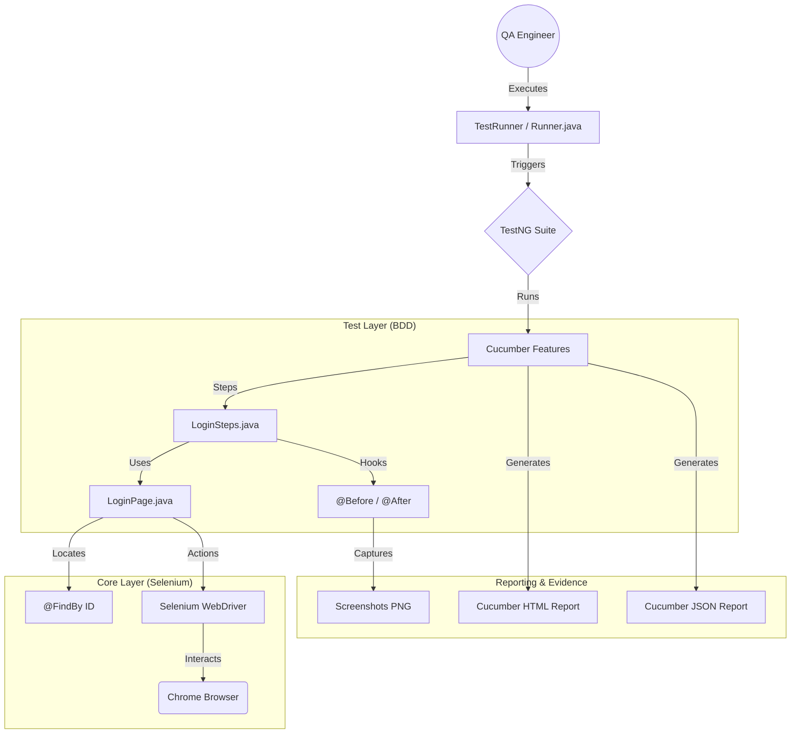

# 🚀 Selenium Automation Framework - RICEPOT Prompt Method
> **Enterprise-Grade Selenium BDD Framework designed using the RICEPOT Prompt Method.**

---

## 📌 Project Overview

This project implements a robust **Selenium Automation Framework** for Salesforce login validation. It leverages the **Page Object Model (POM)** architecture integrated with **Cucumber BDD** and **TestNG**, ensuring scalability, maintainability, and high-quality reporting.

### ✨ Key Features
*   **BDD Excellence:** Gherkin-based scenarios for business readability.
*   **POM Design:** Modular Page Objects using Selenium `PageFactory`.
*   **ID-Only Locators:** Enhanced stability by strictly using unique ID attributes.
*   **Smart Waits:** Zero `Thread.sleep()`; powered by `WebDriverWait`.
*   **Auto-Reporting:** Rich HTML reports with embedded screenshots.

---

## 🏗️ Architecture & Workflow



---

## 🏛️ The RICEPOT Method – Implementation Overview

This framework is built using advanced prompt engineering based on the **RICEPOT** methodology.

Unlike generic prompts that require multiple retries and corrections, RICEPOT enables the AI to produce a complete, enterprise-grade automation framework in a single iteration.

The result is not a collection of disconnected scripts, but a cohesive, production-ready automation system designed to meet enterprise engineering standards from the first generation.

### ❓ What Is RICEPOT?

RICEPOT is a structured prompt-design methodology created for complex, high-impact technical work, including enterprise automation frameworks and production-level software systems.

It provides a disciplined way to guide AI behavior so that the output reflects real-world engineering practices, not experimental or generic solutions.

### 🎯 Why Use RICEPOT?

RICEPOT helps the AI clearly understand what needs to be built and how it should be built. It prevents hallucinations and avoids generating generic or incorrect code.

By using RICEPOT, the AI verifies all rules and constraints before writing any code, ensuring the output follows real project and enterprise standards.

Frameworks generated using RICEPOT are:

*   **✅ More Stable**
    *   Enforce ID-based element identification
    *   Rely on explicit wait strategies rather than timing shortcuts
*   **✅ Easier to Maintain**
    *   Follow strict Page Object Model (POM) principles
    *   Use modular, decoupled components suitable for long-term growth
*   **✅ More Reliable**
    *   Designed with defensive execution patterns
    *   Built to enterprise standards from the first iteration

### 🧩 RICEPOT Prompt Breakdown

The table below illustrates how each RICEPOT component contributes to a single-pass, enterprise-grade framework:

| Component | Definition | Key Objective | Application in This Project |
| :--- | :--- | :--- | :--- |
| **R – Role** | Persona Adoption | Establishes expertise and authority | Senior QA Architect (15+ years) specializing in CRM & Salesforce automation |
| **I – Instructions** | Core Directives | Defines tools and implementation strategy | Java, Cucumber, TestNG, Maven, PageFactory |
| **C – Context** | Environment Scope | Guides architectural decisions | Salesforce CRM login with A/B testing resilience |
| **E – Example** | Pattern Reference | Enforces consistency | ID-only locator examples using `@FindBy(id = "...")` |
| **P – Parameters** | Constraints & Rules | Establishes quality gates | No `Thread.sleep()`, no commented code, defensive execution |
| **O – Output** | Structural Format | Controls deliverables | Page Objects, Feature Files, Step Definitions, Runner, `pom.xml` |
| **T – Tone** | Communication Style | Aligns output expectations | Technical, concise, production-ready |

### 💡 Pro Tip

RICEPOT ensures the AI doesn’t just generate code—it engineers a system.

It enforces decisions that matter in real projects, such as locator stability, execution reliability, framework scalability, and CI/CD compatibility.

### ⚔️ Generic Prompt vs. RICEPOT Prompt

| Feature | Generic Prompt | RICEPOT Prompt |
| :--- | :--- | :--- |
| **Output Style** | Snippet-based or partial | Full enterprise framework (POM + BDD) |
| **Wait Strategy** | `Thread.sleep()` | Explicit waits only |
| **Locator Quality** | XPath/CSS (brittle) | ID-only (high stability) |
| **Code Quality** | High technical debt | Production-ready |
| **Scalability** | Difficult to evolve | Modular and CI/CD ready |

---

## 🧪 Test Scenarios

### 📍 1. Verify Login Page Elements
*   **Objective:** Ensure critical UI components (Username, Password, Login) are visible.
*   **Outcome:** 🟢 PASS | **Evidence:** Screenshot taken.

### 📍 2. Invalid Login Attempt
*   **Objective:** Verify error messaging for incorrect credentials.
*   **Outcome:** 🟢 PASS | **Evidence:** Error validation screenshot.

---

## 📊 Test Execution Evidence

### Execution Summary
| Total Tests | Status | Success Rate |
| :--- | :--- | :--- |
| 2 | ✅ **PASS** | 100% |

### HTML Report Access
The framework generates a detailed HTML report for every run:

*   [**💻 Local View: 📊 Open Latest Run Report**](file:///C:/Users/Welcome/OneDrive/Documents/Naveen%20Ravichandran%20-%20AI%20Testing/Project%204%20-%20Selenium%20Framework%20using%20RICEPOT%20Prompt%20method/target/cucumber-reports/cucumber.html)
*   [**🌐 Online View: 📊 Open Latest Run Report**](file:///C:/Users/Welcome/OneDrive/Documents/Naveen%20Ravichandran%20-%20AI%20Testing/Project%204%20-%20Selenium%20Framework%20using%20RICEPOT%20Prompt%20method/target/cucumber-reports/cucumber.html)

> **💡 Note:** To view the formatted report, click the links above or right-click the file `target/cucumber-reports/cucumber.html` in your project explorer and select **"Open in Browser"**.


### Screenshots
| Login Elements Verification | Invalid Login Error Validation |
| :---: | :---: |
|  |  |

---

## 📁 Project Structure

```text
Project Root
├── src/
│   ├── main/java/.../pages/       # Page Objects (LoginPage.java)
│   ├── test/java/.../steps/       # Step Definitions (LoginSteps.java)
│   ├── test/java/.../runners/     # Test Runners (Runner.java)
│   └── test/resources/features/   # Gherkin Features (.feature)
├── reports/                       # Tracked HTML Reports
├── screenshots/                   # Tracked Execution Screenshots
├── target/                        # Build Artifacts (Ignored)
├── pom.xml                        # Maven Dependencies
├── testng.xml                     # TestNG Config
└── README.md                      # Documentation
```

---

## 🛠️ Setup & Execution

### Prerequisites
*   **Java:** JDK 21+
*   **Build Tool:** Maven
*   **Browser:** Google Chrome

### Commands
```bash
# Clean and run all tests
mvn clean test
```

---

## 📜 License
This project is licensed under the **MIT License** - see the [LICENSE](LICENSE) file for details.

---
<p align="center">Made with ❤️ by Naveen Ravichandran</p>
