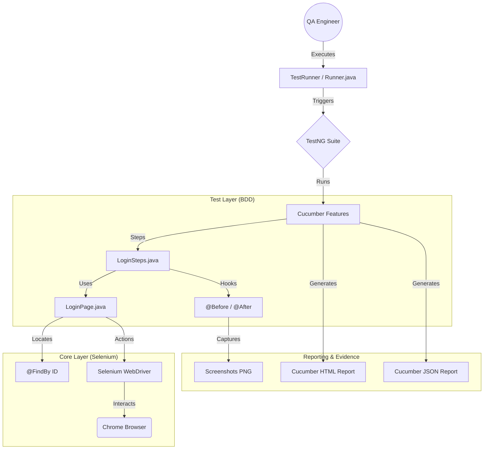

# 🚀 Selenium Automation Framework - RICEPOT Prompt Method
> **Enterprise-Grade Selenium BDD Framework designed using the RICEPOT Prompt Method.**

---

## 📌 Project Overview

This project implements a robust **Selenium Automation Framework** for Salesforce login validation. It leverages the **Page Object Model (POM)** architecture integrated with **Cucumber BDD** and **TestNG**, ensuring scalability, maintainability, and high-quality reporting.

### ✨ Key Features
*   **BDD Excellence:** Gherkin-based scenarios for business readability.
*   **POM Design:** Modular Page Objects using Selenium `PageFactory`.
*   **ID-Only Locators:** Enhanced stability by strictly using unique ID attributes.
*   **Smart Waits:** Zero `Thread.sleep()`; powered by `WebDriverWait`.
*   **Auto-Reporting:** Rich HTML reports with embedded screenshots.

---

## 🏗️ Architecture & Workflow



---

## 🏛️ The RICEPOT Method – Implementation Overview

This framework is built using advanced prompt engineering with the **RICEPOT** method.

Unlike generic prompts that require multiple retries and corrections, RICEPOT enables the AI to produce a complete, enterprise-grade automation framework in a single iteration.

By clearly defining the role, rules, context, and expected output upfront, RICEPOT removes ambiguity and prevents hallucinations. This allows the AI to get it right the first time, without repeated back-and-forth changes.

### ❓ What is RICEPOT?
RICEPOT is a structured way of writing prompts for complex technical work. It is designed for important tasks like building automation frameworks or production-level code.

RICEPOT makes sure that everything needed for a software project is clearly defined upfront — such as the role, rules, context, examples, and expected output — so the AI knows exactly what to deliver.

### 🎯 Why use RICEPOT?
RICEPOT helps the AI clearly understand **what** needs to be built and **how** it should be built. It prevents hallucinations and avoids generating generic or incorrect code.

By using RICEPOT, the AI verifies all rules and constraints before writing any code, ensuring the output follows real project and enterprise standards. This results in a framework that is:

*   **More Stable:** Because it enforces ID-based locators and proper waiting strategies instead of unreliable shortcuts.
*   **Easier to Maintain:** Because it strictly follows the Page Object Model (POM) structure and modular design.
*   **More Reliable:** Because the AI is guided to think and act like a **Senior Automation Architect**, ensuring industrial-grade quality from the first iteration.

### 🧩 Breakdown of our Prompt
The following table shows how the **RICEPOT** prompt was strategically applied to ensure this framework meets enterprise standards in a single-shot generation:

| Component | Definition | Key Objective | Application in this Project |
| :--- | :--- | :--- | :--- |
| **R - Role** | **Persona Adoption** | Establishes the expertise level and perspective. | **Senior QA Architect (15+ yrs)** specialized in CRM & Salesforce automation. |
| **I - Instructions**| **Core Directives** | Defines the "what" and "how" (tech stack, logic). | Framework using **Java, Cucumber, TestNG, Maven, & PageFactory**. |
| **C - Context** | **Environment Scope** | Provides background for relevant decision-making. | Target: **Salesforce CRM Login** with A/B testing resilience and element validation. |
| **E - Example** | **Pattern Reference**| Minimizes stylistic variations and ensures consistency. | Strict **ID-only locator strategy** via `@FindBy(id = "...")` examples. |
| **P - Parameters** | **Constraints & Rules**| Sets the quality gates and boundaries for the AI. | **Zero bad practices**: No `Thread.sleep()`, no commented code, defensive execution. |
| **O - Output** | **Structural Format** | Defines the exact deliverables and formatting. | **Code-only delivery**: Page Objects, Feature files, Step Defs, Runner, and `pom.xml`. |
| **T - Tone** | **Communication Style**| Matches the communication style to expectations. | **Architect-level precision**: Highly technical, concise, and production-ready. |

> **Pro Tip:** RICEPOT ensures that the AI doesn't just "give a script," but builds a **complete system** that respects engineering constraints like locator stability and wait strategies.

### ⚔️ Generic Prompt vs. RICEPOT Prompt
| Feature | Generic Prompt | RICEPOT Prompt (This Project) |
| :--- | :--- | :--- |
| **Output Style** | Snippet-based / Single file | Full Enterprise Framework (POM, BDD) |
| **Wait Strategy** | Often uses `Thread.sleep()` | Smart `WebDriverWait` (Explicit Only) |
| **Locator Quality**| Mix of XPath/CSS (Brittle) | **Strictly ID-based** (High Stability) |
| **Code Review** | High technical debt | Production-ready / Zero technical debt |
| **Scalability** | Hard to maintain | Modular, decoupled, and CI/CD ready |

---

## 🧪 Test Scenarios

### 📍 1. Verify Login Page Elements
*   **Objective:** Ensure critical UI components (Username, Password, Login) are visible.
*   **Outcome:** 🟢 PASS | **Evidence:** Screenshot taken.

### 📍 2. Invalid Login Attempt
*   **Objective:** Verify error messaging for incorrect credentials.
*   **Outcome:** 🟢 PASS | **Evidence:** Error validation screenshot.

---

## 📊 Test Execution Evidence

### Execution Summary
| Total Tests | Status | Success Rate |
| :--- | :--- | :--- |
| 2 | ✅ **PASS** | 100% |

### HTML Report Access
The framework generates a detailed HTML report for every run:

*   [**💻 Local View: 📊 Click to Open Local Report**](file:///C:/Users/Welcome/OneDrive/Documents/Naveen%20Ravichandran%20-%20AI%20Testing/Project%204%20-%20Selenium%20Framework%20using%20RICEPOT%20Prompt%20method/target/cucumber-reports/cucumber.html)
*   [**🌐 Online View: 📊 Live Report Preview (GitHub)**](https://raw.githack.com/Naveen-Ravichandran003/Selenium-framework-using-RICEPOT-prompt-method/main/reports/cucumber.html)

> **💡 Note:** The **Local View** link is for opening the report directly from your computer (works in most IDEs). The **Online View** uses GitHack to render the report directly on GitHub. If you cannot click the links, right-click the file `target/cucumber-reports/cucumber.html` and select **"Open in Browser"**.

### Screenshots
| Login Elements Verification | Invalid Login Error Validation |
| :---: | :---: |
|  |  |

---

## 📁 Project Structure

```text
Project Root
├── src/
│   ├── main/java/.../pages/       # Page Objects (LoginPage.java)
│   ├── test/java/.../steps/       # Step Definitions (LoginSteps.java)
│   ├── test/java/.../runners/     # Test Runners (Runner.java)
│   └── test/resources/features/   # Gherkin Features (.feature)
├── reports/                       # Tracked HTML Reports
├── screenshots/                   # Tracked Execution Screenshots
├── target/                        # Build Artifacts (Ignored)
├── pom.xml                        # Maven Dependencies
├── testng.xml                     # TestNG Config
└── README.md                      # Documentation
```

---

## 🛠️ Setup & Execution

### Prerequisites
*   **Java:** JDK 21+
*   **Build Tool:** Maven
*   **Browser:** Google Chrome

### Commands
```bash
# Clean and run all tests
mvn clean test
```

---
<p align="center">Made with ❤️ by Naveen Ravichandran</p>
