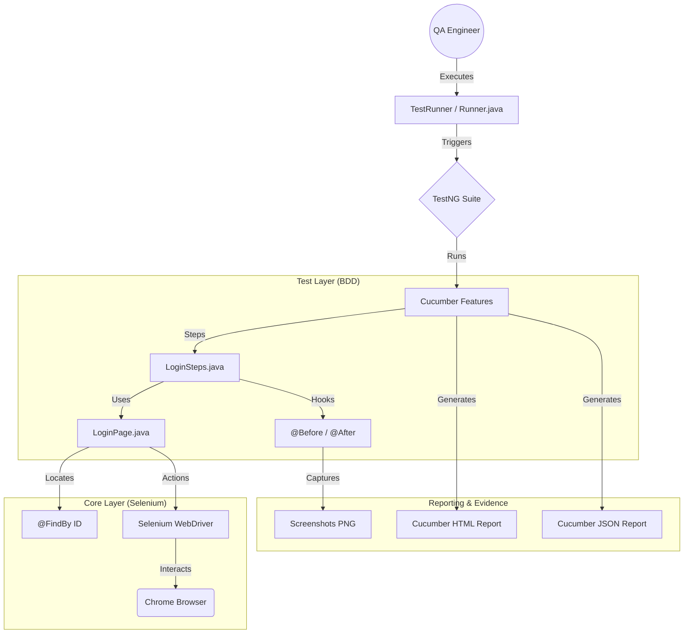

# 🚀 Salesforce Automation Framework
> **Enterprise-Grade Selenium BDD Framework designed using the RICEPOT Prompt Method.**

---

## 📌 Project Overview

This project implements a robust **Selenium Automation Framework** for Salesforce login validation. It leverages the **Page Object Model (POM)** architecture integrated with **Cucumber BDD** and **TestNG**, ensuring scalability, maintainability, and high-quality reporting.

### ✨ Key Features
*   **BDD Excellence:** Gherkin-based scenarios for business readability.
*   **POM Design:** Modular Page Objects using Selenium `PageFactory`.
*   **ID-Only Locators:** Enhanced stability by strictly using unique ID attributes.
*   **Smart Waits:** Zero `Thread.sleep()`; powered by `WebDriverWait`.
*   **Auto-Reporting:** Rich HTML reports with embedded screenshots.

---

## 🏗️ Architecture & Workflow



---

## 🏛️ The RICEPOT Method Implementation

This framework is a direct result of advanced **Prompt Engineering**. By applying the **RICEPOT** framework, we ensured production-ready code from the first iteration.

| Component | Definition | Application |
| :--- | :--- | :--- |
| **R - Role** | **Senior Architect** | 15+ years exp. focusing on stability and zero technical debt. |
| **I - Instructions**| **Specifications** | Java 21, Selenium 4, Cucumber, TestNG, Maven, PageFactory. |
| **C - Context** | **Domain Specifics** | Salesforce Login (Dynamic elements, A/B testing environment). |
| **E - Example** | **Code Standards** | Strict `@FindBy(id = "...")` enforcement. |
| **P - Parameters** | **Quality Gates** | Zero bad practices, robust exception handling, smart waits. |
| **O - Output** | **Deliverables** | Maven structure, Feature files, Step Defs, Runner, POM. |
| **T - Tone** | **Interaction Style**| Highly technical, precise, and professional. |

---

## 🧪 Test Scenarios

### 📍 1. Verify Login Page Elements
*   **Objective:** Ensure critical UI components (Username, Password, Login) are visible.
*   **Outcome:** 🟢 PASS | **Evidence:** Screenshot taken.

### 📍 2. Invalid Login Attempt
*   **Objective:** Verify error messaging for incorrect credentials.
*   **Outcome:** 🟢 PASS | **Evidence:** Error validation screenshot.

---

## 📊 Test Execution Evidence

### Execution Summary
| Date | Total Tests | Status | Success Rate |
| :--- | :--- | :--- | :--- |
| 2026-02-04 | 2 | ✅ **PASS** | 100% |

### HTML Report Access
The framework generates a detailed HTML report for every run:
*   [**� Open Local Test Report (Browser)**](file:///C:/Users/Welcome/OneDrive/Documents/Naveen%20Ravichandran%20-%20AI%20Testing/Project%204%20-%20Selenium%20Framework%20using%20RICEPOT%20Prompt%20method/target/cucumber-reports/cucumber.html)
*   [**� View Relative Report (IDE)**](./target/cucumber-reports/cucumber.html)

### Screenshots
| Login Elements Verification | Invalid Login Error Validation |
| :---: | :---: |
|  |  |

---

## 📁 Project Structure

```text
Project Root
├── src/
│   ├── main/java/.../pages/       # Page Objects (LoginPage.java)
│   ├── test/java/.../steps/       # Step Definitions (LoginSteps.java)
│   ├── test/java/.../runners/     # Test Runners (Runner.java)
│   └── test/resources/features/   # Gherkin Features (.feature)
├── reports/                       # Tracked HTML Reports
├── screenshots/                   # Tracked Execution Screenshots
├── target/                        # Build Artifacts (Ignored)
├── pom.xml                        # Maven Dependencies
├── testng.xml                     # TestNG Config
└── README.md                      # Documentation
```

---

## 🛠️ Setup & Execution

### Prerequisites
*   **Java:** JDK 21+
*   **Build Tool:** Maven
*   **Browser:** Google Chrome

### Commands
```bash
# Clean and run all tests
mvn clean test
```

---
<p align="center">Made with ❤️ by Naveen Ravichandran</p>
